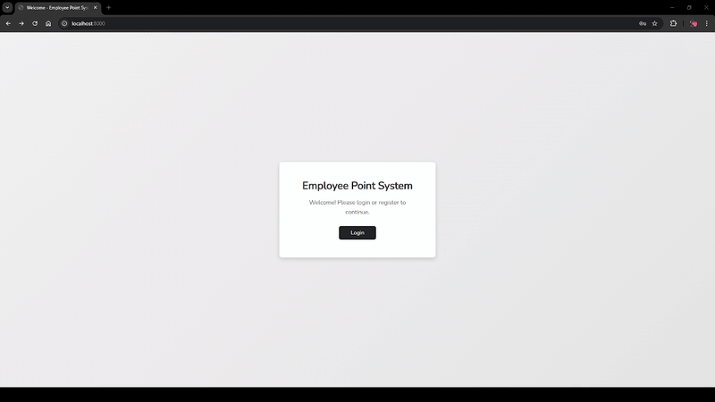
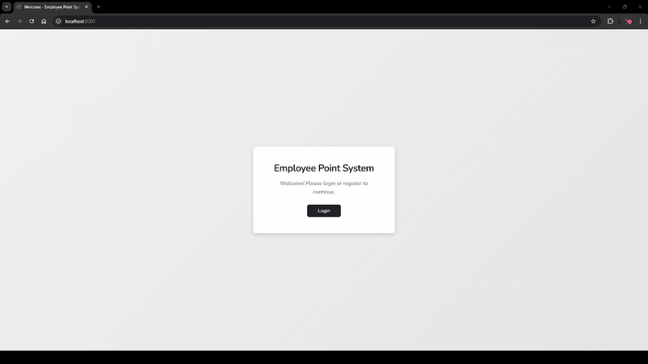

# Employee Point System

A simple Laravel-based system to register employee points with two levels of access (admin and employee). The application uses Laravel 11, MySQL 8.0.41, Docker, Mailhog for email testing, Vite for asset bundling, and Yarn for dependency management.

## Table of Contents

- [Prerequisites](#prerequisites)
- [Installation](#installation)
- [Environment Setup](#environment-setup)
- [Docker Setup](#docker-setup)
- [Running the Application](#running-the-application)
- [Database Migrations and Seeding](#database-migrations-and-seeding)
- [Accessing the Application](#accessing-the-application)
- [Admin and Employee Interfaces](#admin-and-employee-interfaces)
- [Additional Notes](#additional-notes)

## Prerequisites

Before starting, ensure you have installed:

- [Docker Desktop](https://www.docker.com/products/docker-desktop/)
- [Docker Compose](https://docs.docker.com/compose/)

## Installation

1. **Clone the repository:**

   ```bash
   git clone https://github.com/davi-caldeira/employee-point-system
   cd employee-point-system
   ```

## Environment Setup

1. **Copy the Environment File:**

   ```bash
   cp .env.example .env
   ```

## Docker Setup

We use Docker Compose to run three services:

- **app:** The Laravel application (PHP-FPM)
- **mysql:** MySQL database (version 8.0.41)
- **mailhog:** Mailhog for testing emails (receive reset password emails here)
- **vite:** A separate container for the Vite dev server

## Running the Application

1. **Build and Start Containers:**

   From the project root, run:
   ```bash
   docker-compose up -d --build
   ```

2. **Generate Application Key & Run Migrations:**

   ```bash
   docker-compose exec app php artisan key:generate
   docker-compose exec app php artisan migrate --seed
   ```

3. **Run Laravel Enviroment:**

   ```bash
    docker-compose exec app php artisan serve --host=0.0.0.0 --port=8000
   ```

4. **Access the Application:**

   - Laravel App: [http://localhost:8000](http://localhost:8000) - (Access here to see the app)
   - Vite Dev Server (for HMR): [http://localhost:5173](http://localhost:5173)
   - Mailhog Web Interface: [http://localhost:8025](http://localhost:8025) - (Use this for "forgot-password", this is a local mail server)

   The Vite dev server runs in a separate container. Its configuration (see `vite.config.js`) is set to bind to `0.0.0.0` in Docker while serving URLs with `localhost`.

4. **Asset Development:**

   For development with hot module replacement (HMR), ensure the Vite container is running. Laravel will load assets from `VITE_URL="http://localhost:5173"` as specified in your .env file.

## Database Migrations and Seeding

- **Migrations:**  
  Run migrations with:
  ```bash
  docker-compose exec app php artisan migrate
  ```

- **Seeders:**  
  Our seeders include:
  - **AdminUserSeeder:** Creates an admin user.
  - **EmployeeUserSeeder:** Creates an employee managed by the admin.
  - **EmployeePointSeeder:** Creates point records for employees.
  
  To seed your database, run:
  ```bash
  docker-compose exec app php artisan db:seed
  ```

## Accessing the Application

- **Admin Dashboard:**  
  Once logged in as admin (e.g., using the credentials from your seeders), access the admin dashboard at:  
  `http://localhost:8000/admin/dashboard`

  <!-- Insert GIF demonstrating the admin dashboard here -->
  

- **Employee Dashboard:**  
  After logging in as an employee, the dashboard is available at:  
  `http://localhost:8000/employee/dashboard`

  <!-- Insert GIF demonstrating the employee dashboard here -->
  

## Additional Notes

- **Caching and Throttle:**  
  - The CEP endpoint in `CepController` caches responses for 24 hours.
  - Throttling is applied to the CEP endpoint (10 requests per minute) via route middleware.
  
- **Asset Handling:**  
  - Ensure that the `public/hot` file does not exist in production mode.  
  - For HMR, the Vite container is configured in `vite.config.js` to expose assets on port 5173.

- **Troubleshooting:**  
  - If assets (CSS/JS) are not loading, verify that your VITE_URL environment variable is correctly set, and that there are no stale `public/hot` files.
  - Check logs for the Vite container with:  
    ```bash
    docker logs employee-vite
    ```

- **Stopping Containers:**  
  To stop all containers, run:
  ```bash
  docker-compose down
  ```


